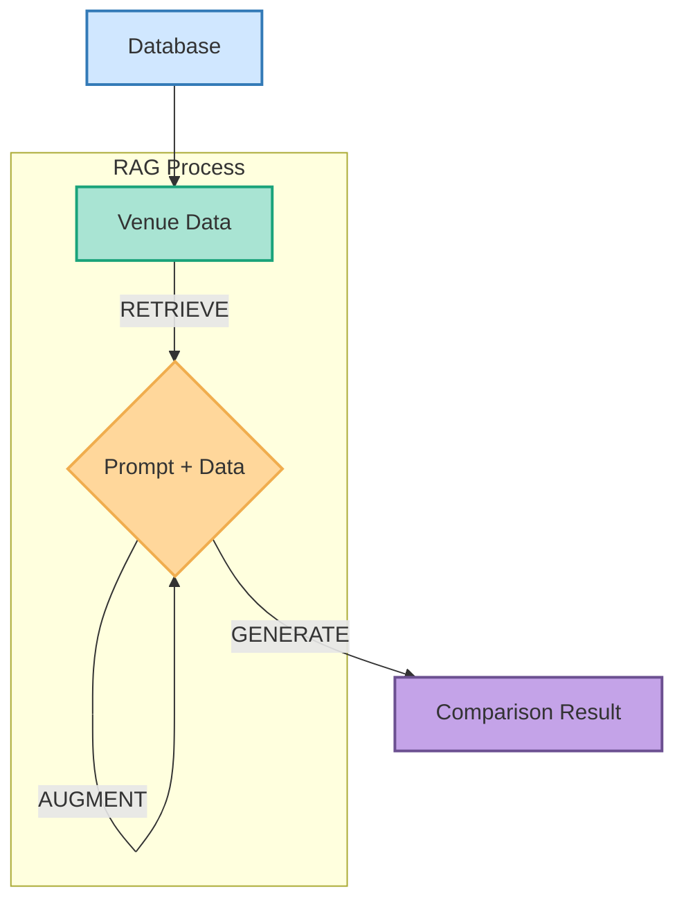

import { Tweet } from 'astro-embed'
import { Image } from 'astro:assets'

import index from '../../assets/images/ai-workshop/index.png'
import detail from '../../assets/images/ai-workshop/detail.png'
import comment from '../../assets/images/ai-workshop/comment.png'
import formNew from '../../assets/images/ai-workshop/new.png'
import nano1 from '../../assets/images/ai-workshop/nano-1.png'
import nano2 from '../../assets/images/ai-workshop/nano-2.png'

## Pembuka

### Tentang Workshop

Berawal dari keresahan dan kesulitan saya dalam mencari contoh kasus penerapan AI yang bukan chatbot, lalu saya coba buat thread tweet ini.

<a
  href="https://x.com/rizafahmi22/status/1948654262013071819"
  target="_blank"
  rel="noopener noreferrer"
  class="text-sm text-blue-600 hover:underline"
>
  <Tweet id="https://x.com/rizafahmi22/status/1948654262013071819" />
</a>

### Objektif

Tujuan workshop ini adalah untuk melihat berbagai skenario penerapan AI/LLM di produk/aplikasi baru atau yang sudah ada sebelumnya. Agar tidak melulu membangun chatbot.

### Logistik

Untuk mengikuti workshop ini diharapkan teman-teman sudah memiliki:

- Web browser: Google Chrome versi 127 atau yang lebih baru
- Code editor: VS Code, Cursor, Zed, VIM, Emacs, apapun
- Dapat menjalankan SQLite versi 3
- Version control GIT dan akun GitHub
- Akun Google untuk mengakses AI melalui AIStudio

### Pengetahuan yang Diperlukan

- Dasar JavaScript/TypeScript
- Pemahaman REST API
- Konsep async/await

#### Aplikasi

Kita akan menggunakan aplikasi Workspresso sebagai aplikasi yang akan kita kembangkan fitur-fitur AI. Dari aplikasi ini, kira-kira fitur AI apa yang bisa kita kembangkan?

##### Halaman Utama

<Image src={index} alt="halaman index" />

##### Halaman Detail

<Image src={detail} alt="halaman detail" />

##### Komentar

<Image src={comment} alt="Fitur Komentar" />

##### Data Baru

<Image src={formNew} alt="Form Baru" />

## Persiapan Proyek

Clone repo berikut lalu masuk ke folder tersebut kemudian jalankan `npm install` dan setelah selesai jalankan `npm run dev`.

```bash
git clone https://github.com/rizafahmi/workspresso.git
cd workspresso
npm install
npm run dev
```

## Mengakses Gemini LLM

Ada dua cara mengakses Gemini LLM: melalui aistudio atau vertex gcp. Untuk kemudahan akses dan ujicoba lebih mudah menggunakan aistudio. Namun jika ingin membangun aplikasi yang siap dijalankan di level production, disarankan menggunakan vertex.

Untuk mulai menggunakan silakan login dengan akun GCP terlebih dahulu ke [https://aistudio.google.com/](https://aistudio.google.com/) lalu menuju ke [https://aistudio.google.com/app/apikey](https://aistudio.google.com/app/apikey) atau pilih menu "Get API Key" untuk membuat API Key baru yang akan kita gunakan di kode nantinya.

Lalu pilih "Create API Key" dan pilih proyek dari GCP sebelumnya. Dan salin API Key untuk nantinya akan dimasukkan kedalam *environment variable* atau file `.env`

### `.env`

```
GOOGLE_API_KEY=apiKeyKamu
```

Menggunakan Gemini dengan AIStudio tidak akan merogoh kocek, meskipun aksesnya dibatasi. Cocok untuk kita yang ingin eksperimen terlebih dahulu. Untuk yang lebih serius disarankan menggunakan Vertex.

### Mengirim data ke Gemini API

Cukup menggunakan fetch, tidak perlu menggunakan library tambahan seperti `@google/genai`, `ai` dari vercel apalagi langchain. Alasannya:

- Mengurangi dependency dan ukuran bundle
- Lebih fleksibel untuk customization
- Memahami cara kerja API secara fundamental

#### `index.astro`

```ts
// FEAT 0: ⚠️ Access Gemini AI ⚠️
import { generate } from '../ai.ts'

console.log(await generate('What is the meaning of life?', {}))
```

#### `ai.ts`

```ts
type Result = { status: 'ok' | 'ko'; text?: string; error?: string }

export async function generate(
  prompt: string,
  config: Record<string, unknown> = {}
): Promise<Result> {
  const url = `https://generativelanguage.googleapis.com/v1beta/models/gemini-2.5-flash:generateContent`

  try {
    const result = await fetch(url, {
      method: 'POST',
      headers: {
        'Content-Type': 'application/json',
        'x-goog-api-key': import.meta.env.GOOGLE_API_KEY,
      },
      body: JSON.stringify({
        contents: [
          {
            parts: [{ text: prompt }],
          },
        ],
        generationConfig: config,
      }),
    })

    const { candidates } = await result.json()
    const text = candidates?.[0]?.content?.parts?.[0]?.text ?? ''
    return { status: 'ok', text }
  } catch (err) {
    return {
      status: 'ko',
      error: (err as Error).message,
    }
  }
}
```

## AI di Antarmuka Aplikasi

### 1. Smart Paste

LLM bisa digunakan untuk melakukan ekstraksi data yang tidak terstruktur menjadi lebih terstruktur. Misalnya untuk kebutuhan menambahkan data baru kita bisa mempermudah kerja pengguna dengan cara menyediakan fitur "smart paste". Pengguna bisa melakukan copy data teks dari mana saja kemudian data tersebut dapat dikirimkan ke LLM. Lalu LLM akan melakukan ekstraksi dan menyesuaikan dengan form yang kita punya di aplikasi.

#### `new.astro`

```astro
<!--
FEAT 1: ⚠️ Smart Paste Button ⚠️
-->
<button id="paste" type="button" class="...">SMART PASTE</button>
```

```astro
<script>
  /* FEAT 1: ⚠️ Smart Paste Logic ⚠️ */
  const pasteButton = document.querySelector('#paste')
  pasteButton.addEventListener('click', async () => {
    pasteButton.disabled = true
    const text = await navigator.clipboard.readText()

    const response = await fetch('/api/generate', {
      method: 'POST',
      headers: {
        'Content-Type': 'application/json',
      },
      body: JSON.stringify({
        prompt: `Your purpose is to categorize and extract unstructured data about cafes from user input. Do not add any additional information or explanations. If no information is available for a field, you decide what to fill based on the text given. Field hours use this format: 07:00 - 22:00. Use short sentence to describe vibe field. For description field, write 1-2 sentences about workspace amenities, atmosphere, and unique features. For tags field, generate comma-separated keywords (no spaces after commas) related to the venue's amenities and characteristics. Choose color based on vibe, one of "emerald", "amber", "violet", or "orange". Then you grade based on the data, either 'A', 'B', 'C', or 'D'. Use English for all responses.

      Classify the following data:
      <user_data>
      ${text}
      </user_data>`,
        config: {
          responseMimeType: 'application/json',
          responseSchema: {
            type: 'OBJECT',
            properties: {
              name: { type: 'STRING' },
              description: { type: 'STRING' },
              tags: { type: 'STRING' },
              address: { type: 'STRING' },
              hours: { type: 'STRING' },
              wifiScore: { type: 'INTEGER' },
              powerScore: { type: 'INTEGER' },
              noiseScore: { type: 'INTEGER' },
              seatingScore: { type: 'INTEGER' },
              vibe: { type: 'STRING' },
              color: { type: 'STRING' },
              url: { type: 'STRING' },
              grade: { type: 'STRING' },
            },
          },
        },
      }),
    })

    const result = await response.json()

    if (result.status === 'ok') {
      const parsed = JSON.parse(result.text)

      const nameInput = document.querySelector('input[name="name"]')
      const addressInput = document.querySelector('input[name="address"]')
      const hoursInput = document.querySelector('input[name="hours"]')
      const colorInput = document.querySelector('input[name="color"]')
      const vibeInput = document.querySelector('input[name="vibe"]')
      const gradeInput = document.querySelector('input[name="grade"]')

      const wifiScoreRange = document.querySelector('input[name="wifiScore"]')
      const powerScoreRange = document.querySelector('input[name="powerScore"]')
      const noiseScoreRange = document.querySelector('input[name="noiseScore"]')
      const seatingScoreRange = document.querySelector(
        'input[name="seatingScore"]'
      )
      const descriptionInput = document.querySelector(
        'textarea[name="description"]'
      )
      const tagsInput = document.querySelector('input[name="tags"]')

      nameInput.value = parsed.name || ''
      addressInput.value = parsed.address || ''
      descriptionInput.value = parsed.description || ''
      tagsInput.value = parsed.tags || ''
      hoursInput.value = parsed.hours || ''
      colorInput.value = parsed.color || ''
      vibeInput.value = parsed.vibe || ''
      gradeInput.value = parsed.grade || 'D'
      wifiScoreRange.value = parsed.wifiScore || '3'
      powerScoreRange.value = parsed.powerScore || '3'
      noiseScoreRange.value = parsed.noiseScore || '3'
      seatingScoreRange.value = parsed.seatingScore || '3'
    }
    pasteButton.disabled = false
  })
</script>
```

### 2. Pencarian semantik

Saat ini pencarian hanya berdasarkan kata-kata yang terdapat di nama dan deskripsi, exact word. Kita bisa implementasi pencarian semantik atau semantic search dengan beberapa cara.
Pencarian semantik adalah proses pencarian berdasarkan kemiripan atau similarity. Jika kita mencari kata coffee, tentu kata yang mendekati adalah cafe jika dibandingkan dengan hospital meskipuna di rumah sakit banyak juga orang yang minum kopi.

Bacaan lebih lanjut: https://openai.com/index/introducing-text-and-code-embeddings/

#### Menggunakan bm25

BM25, atau Best Match 25, jangan diremehkan dulu, walaupun berasal dari jaman tahun 70-an. Sudah dipakai (dan masih akan tetap ada) di berbagai macam software ternama seperti Elasticsearch, Lucene, Solr, dll., BM25 masih sangat efektif sebagai algoritma pencarian.

Informasi lebih lanjut: https://en.wikipedia.org/wiki/Okapi_BM25. Kodenya saya adaptasi dari repo berikut: https://github.com/ariya/text-match.

##### `index.astro`

```ts
// FEAT 2: ⚠️ Use bm25 algorithm for basic semantic search ⚠️
for (const venue of venues) {
  const text = `Name: ${venue.name}, Description: ${venue.description}, Known for: ${venue.vibe}, Tags: ${venue.tags}`
  const similarity = bm25(query, text)
  console.log(similarity)
  results.push({ ...venue, similarity })
}
venues = results.sort((a, b) => b.similarity - a.similarity).slice(0, 3)
```

#### `embeddings.ts`

```ts
export function bm25(query: string, sentence: string) {
  const k1 = 1.2
  const b = 0.75

  const terms = tokenize(sentence)
  const qt = tokenize(query)

  const df = {}
  const uniqueTerms = new Set(terms)
  uniqueTerms.forEach((term) => {
    df[term] = (df[term] || 0) + 1
  })

  const avgdl = terms.length
  let score = 0
  qt.forEach((qi) => {
    if (df[qi]) {
      const idf = Math.log((1 - df[qi] + 0.5) / (df[qi] + 0.5) + 1)
      const tf = terms.filter((term) => term === qi).length
      const numerator = tf * (k1 + 1)
      const denominator = tf + k1 * (1 - b + b * (terms.length / avgdl))
      score += idf * (numerator / denominator)
    }
  })

  return score
}

function tokenize(text: string) {
  const result = text
    .toLowerCase()
    .replace(/[^\w\s]|_/g, '')
    .replace(/\s+/g, ' ')
    .split(' ')
    .filter((term) => term)

  return result
}
```

#### Menggunakan Model yang tersedia di HuggingFace

AI bukan hanya LLM. Ada banyak model yang berukuran lebih kecil yang dapat melakukan tugas spesifik: klasifikasi teks, transalasi, merangkum, dan banyak lagi. Salah satunya [sentence similarity](https://huggingface.co/models?pipeline_tag=sentence-similarity&sort=trending) Ada beberapa model yang ukurannya cukup kecil: [bge-micro-v2](https://huggingface.co/TaylorAI/bge-micro-v2) dan [all-MiniLM-L6-v2](https://huggingface.co/sentence-transformers/all-MiniLM-L6-v2). Dan untuk menggunakannya, dapat dijalankan di sisi server atau di sisi client dengan library [transformers](https://huggingface.co/docs/transformers.js/en/index) yang dapat menjalankan pretrained model dari huggingface.

##### `index.astro`

```ts
// FEAT 2: ⚠️ Use hugging-face model for similarity search ⚠️
const queryEmbed = await embedText(query)

for (const venue of venues) {
  const text = `Name: ${venue.name}, Description: ${venue.description}, Known for: ${venue.vibe}, Tags: ${venue.tags}`
  const venueEmbed = await embedText(text)
  const similarity = cosineSimilarity(queryEmbed, venueEmbed)
  results.push({ ...venue, similarity })
}
venues = results.sort((a, b) => b.similarity - a.similarity).slice(0, 3)
```

#### `embeddings.ts`

```ts
import { pipeline } from '@huggingface/transformers'

export async function embedText(
  text: string,
  task = 'embeddings',
  model = 'TaylorAI/bge-micro-v2'
) {
  const embedding = await pipeline(task, model, { dtype: 'auto' })
  const { data } = await embedding(text, {
    pooling: 'cls',
    normalize: true,
  })
  return data
}

export function cosineSimilarity(vec1: Array<number>, vec2: Array<number>) {
  let result = 0
  for (let i = 0; i < vec1.length; i++) {
    result += vec1[i] * vec2[i]
  }

  return result
}
```

Secara umum, BM25 cocok untuk:

- Pencarian berbasis keyword yang tepat
- Resource terbatas (tidak perlu download model)
- Latency rendah

Sedangkan teknik embeddings cocok untuk:

- Pencarian semantik yang lebih "mengerti konteks"
- Query yang sinonimnya beragam

## AI di Logika Aplikasi

### 3. Analisa Sentimen

Dan selain ada LLM yang berukuran besar ada pula model yang berukuran kecil sehingga dapat dijalankan dengan sumber daya yang terbatas. Bahkan dapat dijalankan secara local. Selain hemat biaya, SLM ini juga dapat digunakan untuk memproses data yang sifatnya pribadi tanpa perlu mengirimkan data pribadi tersebut ke sebuah server karena dapat berjalan di mesin pengguna.

Sebagai contoh kita dapat menggunakan Gemini Nano yang sudah tersedia di Google Chrome. Namun perlu diaktifkan terlebih dahulu.

Pertama, buka dan nyalakan opsi chrome://flags/#prompt-api-for-gemini-nano

<Image src={nano1} alt="nano" />

Lalu kemudian buka dan nyalakan opsi chrome://flags/#optimization-guide-on-device-model

<Image src={nano2} alt="nano" />

TODO:

- Jelaskan **kenapa** harus menggunakan Chrome Dev/Canary
- Tambahkan fallback jika Gemini Nano tidak tersedia
- Berikan estimasi ukuran model yang akan di-download

Kita akan implementasi analisa sentimen dari komentar yang dikirimkan pengguna.

#### `[id].astro`

```ts
<script>
    // FEAT 3: ⚠️ Headstart Gemini Nano ⚠️
    /* Upgrade to Chrome Dev / Canary version 127 or higher.
    Make sure to enable Gemini Nano in Chrome flags:
    chrome://flags/#prompt-api-for-gemini-nano to "Enabled"
    chrome://flags/#optimization-guide-on-device-model to "Enabled BypassPrefRequirement"
    Go to chrome://components and click "Check for Update" on "Optimization Guide On Device Model"
    */

    const availability = await LanguageModel.availability();
    let session;
    if (availability !== "unavailable") {
        session = await startAISession();
    }

    // Handle comment form submission
    const commentForm = document.getElementById(
        "comment-form",
    ) as HTMLFormElement;
    const commentSuccess = document.getElementById("comment-success");

    commentForm?.addEventListener("submit", async (e) => {
        e.preventDefault();

        const formData = new FormData(commentForm);
        const userName = formData.get("userName") as string;
        const comment = formData.get("comment") as string;
        const fileUpload = formData.get("fileUpload") as File;
        const venueId = window.location.pathname.split("/").pop();

        let sentiment = "";
        // FEAT 3: ⚠️ Analyze sentiment using Chrome's build in gemini nano ⚠️
        sentiment = (await analyzeSentiment(session, comment)) as string;

        let imageUrl = null;

        // Handle file upload if present
        if (fileUpload && fileUpload.size > 0) {
            const reader = new FileReader();
            const base64Promise = new Promise((resolve) => {
                reader.onloadend = () => resolve(reader.result);
                reader.readAsDataURL(fileUpload);
            });
            imageUrl = await base64Promise;
        }

        try {
            const response = await fetch("/api/comments", {
                method: "POST",
                headers: {
                    "Content-Type": "application/json",
                },
                body: JSON.stringify({
                    venueId: Number(venueId),
                    userName,
                    comment,
                    sentiment,
                    imageUrl,
                }),
            });

            if (response.ok) {
                commentSuccess?.classList.remove("hidden");
                commentForm.reset();

                // Reload page after 1.5 seconds to show new comment
                setTimeout(() => {
                    window.location.reload();
                }, 1500);
            } else {
                alert("Failed to post comment. Please try again.");
            }
        } catch (error) {
            console.error("Error posting comment:", error);
            alert("An error occurred. Please try again.");
        }
    });

    // FEAT 3: ⚠️ Analyze function ⚠️
    async function analyzeSentiment(session, comment) {
        const result = await session.prompt(`User: ${comment.trim()}`);
        console.log(result);

        return result;
    }

    // FEAT 3: ⚠️ Function to start Gemini Nano session ⚠️
    async function startAISession() {
        const session = await LanguageModel.create({
            initialPrompts: [
                {
                    role: "system",
                    content: `Your job is to categorize whether text has a positive or negative sentiment. Just return either positive, negative or neutral. Here are some examples of text you might see:

                    User: I love this cafe!
                    Assistant: positive
                    User: Bagus sekali.
                    Assistant: positive
                    User: Kopinya pahit.
                    Assistant: negative
                    User: Meh..
                    Assistant: neutral
                    User: Could be better.
                    Assistant: neutral

                    Now it's your turn!
                    `,
                },
            ],
            monitor: (m) => {
                m.addEventListener("downloadprogress", (e) => {
                    console.info(`Downloaded ${e.loaded * 100}%`);
                });
            },
        });
        return session;
    }
</script>
```

### 4. Klasifikasi Teks

Berikutnya, untuk semakin memudahkan pengguna dalam mengisi form, kita akan otomasi pengisian tags berdasarkan deskripsi.

#### `new.astro`

```ts
import Layout from '../layouts/Layout.astro'
import { icons } from '../components/icons'
import { eq, db, Venue } from 'astro:db'
import { generateTags } from '../ai.ts'

const message = 'Help others find great work spots'

if (Astro.request.method === 'POST') {
  const formData = await Astro.request.formData()
  const name = formData.get('name')
  const description = formData.get('description')
  const tags = formData.get('tags')
  const address = formData.get('address')
  const hours = formData.get('hours')
  const wifiScore = formData.get('wifiScore')
  const powerScore = formData.get('powerScore')
  const noiseScore = formData.get('noiseScore')
  const seatingScore = formData.get('seatingScore')
  const vibe = formData.get('vibe')
  const color = formData.get('color')
  const grade = formData.get('grade')

  try {
    const result = await db.insert(Venue).values({
      name,
      description,
      tags,
      address,
      hours,
      wifiScore,
      powerScore,
      noiseScore,
      seatingScore,
      vibe,
      color,
      grade,
    })

    const id = parseInt(result.lastInsertRowid)

    /* FEAT 4: ⚠️ Add tags based on description ⚠️ */
    updateVenueTags(id, description)

    return Astro.redirect(`/venue/${id}`)
  } catch (err) {
    console.error(err)
  }
}

/* FEAT 4: ⚠️ Generate tags based on description ⚠️ */
async function updateVenueTags(venueId: number, description: string) {
  if (description) {
    const { labels } = await generateTags(description)
    const tags = labels.join(',')
    await db
      .update(Venue)
      .set({ tags })
      .where(eq(Venue.id, Number(venueId)))
      .run()
  }
}
```

#### `ai.ts`

Kali ini kita menggunakan model [nli-MiniLM2-L6-H768](https://huggingface.co/cross-encoder/nli-MiniLM2-L6-H768) dari huggingface, salah satu model dengan kategori Zero Shot Classification.

```ts
export async function generateTags(text: string) {
  const classifier = await pipeline(
    'zero-shot-classification',
    'cross-encoder/nli-MiniLM2-L6-H768'
  )

  await classifier('warm up', ['a', 'b', 'c'])
  const candidateLabels = [
    'WFC',
    'Cafe',
    'Quiet',
    'Loud',
    'Cozy',
    'Spacious',
    'Fast WiFi',
    'Good for Work',
    'Great Coffee',
    'Crowded',
  ]
  const result = await classifier(text, candidateLabels)
  return result
}
```

### 5. Summarization

Untuk setiap komentar baru yang masuk, akan dirangkum untuk memudah kan pengguna memahami komentar.

#### `api/comments.ts`

```ts
await db.insert(Comment).values({
  venueId: Number(venueId),
  userName: userName.trim(),
  comment: comment.trim(),
  sentiment: sentiment.trim(),
  imageUrl: imageData ? imageData : null,
})

/* FEAT 5: ⚠️ Summarize comments ⚠️ */
updateCommentsSummary(venueId)
```

```ts
/* FEAT 5: ⚠️ Summarize comments function ⚠️ */
async function updateCommentsSummary(venueId) {
  const comments = await db
    .select()
    .from(Comment)
    .where(eq(Comment.venueId, Number(venueId)))
  const prompt = `You are part of customer experience system. Your job is to write brief summaries of customer's comments and interactions. This is to help support agents to understand the context quickly so they can help the venue owner efficiently.

  The comments so far is:

  ${commentList(comments)}

  Write a 10-word summary of all the things CUSTOMER has said. Then based on that summary, score the customer's satisfaction using one of the following phrases ranked from worst to best: worst, bad, ok, good, great, awesome.
  Pay particular attention to the TONE of the customer's message, as we are most interested in their emotional state.
  `
  console.log(prompt)
  const config = {
    responseMimeType: 'application/json',
    responseSchema: {
      type: 'OBJECT',
      properties: {
        summary: { type: 'STRING' },
        satisfaction: { type: 'STRING' },
      },
    },
  }
  const { status, text } = await generate(prompt, config)
  const { summary, satisfaction } = JSON.parse(text)
  console.log({ summary, satisfaction })

  await db
    .update(Venue)
    .set({ summary, satisfaction })
    .where(eq(Venue.id, Number(venueId)))
    .run()
}
```

### 6. Image Classification

Mari kita buat supaya siapa saja yang upload foto di komentar hanya boleh foto makanan, minuman dan menu saja.

#### `api/comments.ts`

```ts
let imageData = null

/* FEAT 6: ⚠️ Check image upload to only accept certain image: food, drink and menu. */
if (imageUrl) {
  const { status, text } = await checkImage(imageUrl)
  const checkData = JSON.parse(text)
  if (checkData.status === 'ACCEPTED') {
    imageData = imageUrl
  }
}
```

```ts
async function checkImage(imageUrl: string) {
  if (!imageUrl) return
  try {
    const prompt = `You will be analyzing an image to determine if it falls into one of three acceptable categories.

    Your task is to determine whether this image shows one of the following three acceptable types:

    1. **Foods** - Any edible items, meals, snacks, ingredients, or food products. This includes prepared dishes, raw ingredients, packaged food items, baked goods, etc.

    2. **Drinks** - Any beverages or liquid refreshments. This includes alcoholic and non-alcoholic drinks, hot and cold beverages, bottled drinks, drinks in glasses or cups, etc.

    3. **Photo of menu** - Images showing restaurant menus, cafe menus, drink menus, food menus, or any printed/digital menu displaying food and/or drink options with descriptions and/or prices.

    When analyzing the image, consider these guidelines:

    - Look carefully at all visible elements in the image
    - If the image contains multiple elements, determine what the primary focus is
    - An image showing both food and drinks should be accepted (categorize based on the primary focus)
    - Menu photos can be physical menus, digital displays, or menu boards
    - Be inclusive rather than restrictive - if something is clearly edible or drinkable, it should be accepted

    For your response:

    First, describe what you observe in the image and explain your reasoning for whether it fits into one of the acceptable categories.

    Then, provide your final determination using one of these exact phrases:
    - "ACCEPTED - Food"
    - "ACCEPTED - Drink"
    - "ACCEPTED - Menu"
    - "REJECTED - Does not match acceptable categories"

    Format your response as follows:
    <analysis>
    [Your detailed observation and reasoning here]
    </analysis>

    <determination>
    [Your final determination using one of the four exact phrases above]
    </determination>`

    const config = {
      responseMimeType: 'application/json',
      responseSchema: {
        type: 'OBJECT',
        properties: {
          status: { type: 'STRING', enum: ['ACCEPTED', 'REJECTED'] },
          type: { type: 'STRING', enum: ['FOOD', 'DRINK', 'MENU'] },
        },
      },
      thinkingConfig: {
        thinkingBudget: 0,
      },
    }

    return sendImageAndGenerate(prompt, imageUrl, config)
  } catch (err) {
    console.error(err)
    throw new Error('Invalid image')
  }
}
```

#### `ai.ts`

```ts
export async function sendImageAndGenerate(
  prompt: string,
  imageData: string,
  config: Record<string, unknown> = {}
): Promise<Result> {
  const url = `https://generativelanguage.googleapis.com/v1beta/models/gemini-2.5-flash:generateContent`

  const { mime, image } = getImageData(imageData)
  const contents = {
    contents: [
      {
        parts: [
          {
            inlineData: { mimeType: mime, data: image },
          },
          { text: prompt },
        ],
      },
    ],
    generationConfig: config,
  }
  try {
    const result = await fetch(url, {
      method: 'POST',
      headers: {
        'Content-Type': 'application/json',
        'x-goog-api-key': import.meta.env.GOOGLE_API_KEY,
      },
      body: JSON.stringify(contents),
    })

    const { candidates } = await result.json()

    const text = candidates?.[0]?.content?.parts?.[0]?.text ?? ''
    return { status: 'ok', text }
  } catch (err) {
    return {
      status: 'ko',
      error: (err as Error).message,
    }
  }
}
```

### 7. RAG

Akhirnya masuk ke bagian RAG. Di luar sana banyak sekali tutorial tentang RAG ini. Kalau ada yang sudah pernah belajar RAG, mungkin mengasosiasikan RAG dengan LLM yang dapat "membaca" dokumen seperti pdf. Tidak salah, itu merupakan salah satu implementasi RAG.
Kali ini saya ingin menggunakan pendekatan yang sedikit berbeda: implementasi RAG yang sangat mendasar sekali. RAG adalah Retrieval-Augmented Generation. Ada tiga kata disini:

1. Retrieval: Menarik data. Sumber data bisa dari mana saja: REST API, mesin pencari, database, dokumen pdf, dsb
2. Augmented: Data yang didapat kemudian disertakan kedalam prompt untuk kemudian dikonsumsi oleh LLM
3. Generation: LLM kemudian akan menjalankan perintah sesuai prompt yang sudah ditambahkan data

Untuk implementasi di aplikasi, kita akan membuat halaman baru untuk membandingkan dua venue.

1. Retrieval: ambil data dua venue yang dipilih
2. Augmented: Masukkan informasi dua venue tersebut kedalam prompt
3. Generation: Buat summary membandingkan kedua venue tersebut



#### `api/compare.ts`

```ts
/* FEAT 7: ⚠️ RAG - Retrieve venue data ⚠️ */
		const [venue1] = await db
			.select()
			.from(Venue)
			.where(eq(Venue.id, id1));

		const [venue2] = await db
			.select()
			.from(Venue)
			.where(eq(Venue.id, id2));

		if (!venue1 || !venue2) {
			return new Response(
				JSON.stringify({ error: "One or both venues not found." }),
				{ status: 400, headers: { "Content-Type": "application/json" } },
			);
		}

		const fmt = (value: string | null | undefined) => value ?? "N/A";

		/* FEAT 7: ⚠️ RAG - Augment & Generation ⚠️ */
		const prompt = `Compare the following two venues for remote work and return the result as JSON:

Venue 1:
- Name: ${venue1.name}
- Wi-Fi: ${venue1.wifiScore}/5
- Power: ${venue1.powerScore}/5
- Noise: ${venue1.noiseScore}/5
- Seating: ${venue1.seatingScore}/5
- Vibe: ${fmt(venue1.vibe)}
- Tags: ${fmt(venue1.tags)}
- Description: ${fmt(venue1.description)}

Venue 2:
- Name: ${venue2.name}
- Wi-Fi: ${venue2.wifiScore}/5
- Power: ${venue2.powerScore}/5
- Noise: ${venue2.noiseScore}/5
- Seating: ${venue2.seatingScore}/5
- Vibe: ${fmt(venue2.vibe)}
- Tags: ${fmt(venue2.tags)}
- Description: ${fmt(venue2.description)}

Return a JSON object with the following structure:
{
  "venue1": {
    "name": "Venue 1 Name",
    "pros": ["List of pros"],
    "cons": ["List of cons"]
  },
  "venue2": {
    "name": "Venue 2 Name",
    "pros": ["List of pros"],
    "cons": ["List of cons"]
  },
  "summary": "A brief summary comparing the two venues for remote work."
}`;

		const { status, text, error } = await generate(prompt, {
			responseMimeType: "application/json",
		});

		if (status === "ko" || !text) {
			console.error("LLM error:", error);
			return new Response(
				JSON.stringify({ error: "Failed to generate comparison." }),
				{ status: 500, headers: { "Content-Type": "application/json" } },
			);
		}

		try {
			const parsed = JSON.parse(text);
			return new Response(JSON.stringify(parsed), {
				status: 200,
				headers: { "Content-Type": "application/json" },
			});
		} catch (parseError) {
			console.error("JSON parse error:", parseError);
			return new Response(
				JSON.stringify({ error: "Model returned invalid JSON." }),
				{ status: 502, headers: { "Content-Type": "application/json" } },
			);
		}
	} catch (err) {
		console.error("Unexpected error:", err);
		return new Response(
			JSON.stringify({ error: "An error occurred." }),
			{ status: 500, headers: { "Content-Type": "application/json" } },
		);
	}
```

Coba bandingkan apabila kita tidak menambahkan data venue kedalam prompt, informasi apa yang akan kita dapatkan?

Lebih keren lagi kalau bisa ditambahkan form untuk memilih. Misalnya user bisa tulis sebaiknya saya ke cafe yang mana ya untuk kerja dan butuh fokus?

## AI di Pengujian

### 8. Evaluasi Model

Meski bukan fitur, namun evaluasi model merupakan hal yang cepat atau lambat dibutuhkan. Apalagi perkembangan AI dan LLM sangat pesat beberapa tahun belakangan. Model jenis baru terus bermunculan, salah satu cara untuk mengetahui apakah model tertentu cocok digunakan untuk aplikasi kita adalah dengan mengevaluasinya.

#### `eval.js`

```js
import { embedText, cosineSimilarity, bm25 } from './embeddings.ts'

const data = `Name: Brew & Bytes Cafe, Description: Perfect workspace for developers and freelancers. High-speed fiber internet, plenty of power outlets, and a quiet atmosphere. Specializes in artisan coffee and healthy snacks., Known for: Modern & Tech-Friendly, Tags: coworking,wifi,quiet,coffee,developers,freelancers,power outlets
Name: The Daily Grind, Description: Traditional coffee shop with solid WiFi and decent seating. Can get noisy during rush hours. Great for casual work sessions and meetings., Known for: Classic Coffee Shop, Tags: coffee shop,traditional,wifi,meetings,casual,downtown
Name: Code & Coffee Co., Description: Premium coworking cafe designed for programmers and tech professionals. Ultra-fast WiFi, standing desks available, and coding-themed decor., Known for: Startup Haven, Tags: coworking,programmers,tech,startup,standing desks,premium,ultra fast wifi
Name: Cafe Momentum, Description: Busy neighborhood cafe with limited workspace amenities. WiFi can be unreliable and outlets are scarce. Better for quick coffee than extended work sessions., Known for: Bustling & Social, Tags: neighborhood,busy,social,coffee,limited amenities
Name: Dummin Coffee & Space UKDW, Description: Dummin Coffee & Space offers a comfortable and conducive atmosphere for concentration, making it a favorite for students and workers. It features fast Wi-Fi, numerous power outlets, and spacious seating on the second floor, perfect for long work sessions., Known for: Productive and cozy atmosphere for students and workers., Tags: Good for Work,Fast WiFi,Cafe,WFC,Great Coffee,Cozy,Spacious,Quiet,Crowded,Loud
Name: Cosan Coffee, Description: Cosan Coffee offers a cozy and simply designed space, ideal for both relaxed gatherings and focused work sessions. It caters well to students and professionals needing to complete tasks., Known for: A modern and cozy space perfect for both productivity and relaxation., Tags: Cafe,Good for Work,Cozy,Great Coffee,WFC,Loud,Crowded,Quiet,Spacious,Fast WiFi
Name: Koat Coffee Palagan, Description: Koat Coffee Palagan offers a cozy workspace with complete facilities including indoor smoking, indoor no-smoking, and outdoor areas extending to a second floor. It's a popular 24-hour spot known for its diverse menu and frequent collaborations with other outlets., Known for: Lively and popular spot with complete facilities for all-day gatherings., Tags: Cafe,Loud,Great Coffee,Cozy,Good for Work,WFC,Crowded,Quiet,Spacious,Fast WiFi
Name: Omore Coffee, Description: Omore Coffee boasts an aesthetic design and a calm atmosphere, perfect for deep conversations or focused work. It offers both indoor and outdoor seating, making it a popular spot for students to study and enjoy delicious coffee and desserts., Known for: Quiet and aesthetic, perfect for deep conversations and special moments., Tags: Loud,Cafe,Good for Work,Great Coffee,Cozy,Quiet,WFC,Crowded,Spacious,Fast WiFi
Name: JK Kopi Seduh, Description: This cafe offers a unique experience with walls covered in striking, colorful graffiti, creating a vibrant atmosphere for local artists' expression. It provides a very comfortable space for gathering and relaxed conversations, with an open view of coffee brewing from strong espresso to soft cappuccino., Known for: Artistic and relaxed with a vibrant, expressive atmosphere., Tags: Cafe,Great Coffee,Good for Work,Crowded,Spacious,Cozy,WFC,Loud,Quiet,Fast WiFi
Name: Ethikopia Coffeebay, Description: Ethikopia Coffeebay is a comfortable and calm place with an interesting and aesthetic interior design. It is perfect for enjoying coffee and conversation with friends or family., Known for: A comfortable and calm atmosphere with an aesthetic design., Tags: Cafe,Cozy,Quiet,Great Coffee,WFC,Good for Work,Spacious,Crowded,Loud,Fast WiFi
`
const query = 'developer' // premium coffee, traditional, modern, quiet, cozy

console.log('BM25')
console.log('================================')
;(function () {
  const sentences = data
    .split('\n')
    .map((line) => line.trim())
    .filter((line) => line.trim().length > 0)
  console.log(`Query: ${query}`)
  console.time('BM25 Execution Time')
  for (const sentence of sentences) {
    const relevancy = bm25(sentence, query)
    const report = sentence.split(', ')[0]
    console.log(`${report} - Score: ${relevancy}`)
  }
  console.timeEnd('BM25 Execution Time')
})()

console.log('\n\n')
console.log('TaylorAI/bge-micro-v2')
console.log('================================')
async function evalBge() {
  const texts = data
    .split('\n')
    .map((line) => line.trim())
    .filter((line) => line.trim().length > 0)
  console.log(`Query: ${query}`)
  console.time('BGE Execution Time')
  const queryEmbed = await embedText(query)

  for (const text of texts) {
    const venueEmbed = await embedText(text)
    const score = cosineSimilarity(queryEmbed, venueEmbed)
    const relevancy = Math.round(score * 100) / 100
    const report = text.split(', ')[0]

    console.log(`${report} - Score: ${relevancy}`)
  }
  console.timeEnd('BGE Execution Time')
}
await evalBge()

console.log('\n\n')
console.log('sentence-transformers/all-MiniLM-L6-v2')
console.log('================================')
async function evalMiniLM() {
  const texts = data
    .split('\n')
    .map((line) => line.trim())
    .filter((line) => line.trim().length > 0)
  console.log(`Query: ${query}`)
  console.time('MiniLM Execution Time')
  const queryEmbed = await embedText(
    query,
    'feature-extraction',
    'sentence-transformers/all-MiniLM-L6-v2'
  )

  for (const text of texts) {
    const venueEmbed = await embedText(
      text,
      'feature-extraction',
      'sentence-transformers/all-MiniLM-L6-v2'
    )
    const score = cosineSimilarity(queryEmbed, venueEmbed)
    const relevancy = Math.round(score * 100) / 100
    const report = text.split(', ')[0]

    console.log(`${report} - Score: ${relevancy}`)
  }
  console.timeEnd('MiniLM Execution Time')
}
await evalMiniLM()
```

## AI di Lapisan Performa

TODO: Menggunakan MCP Chrome DevTools dengan Gemini CLI

## Penutup
